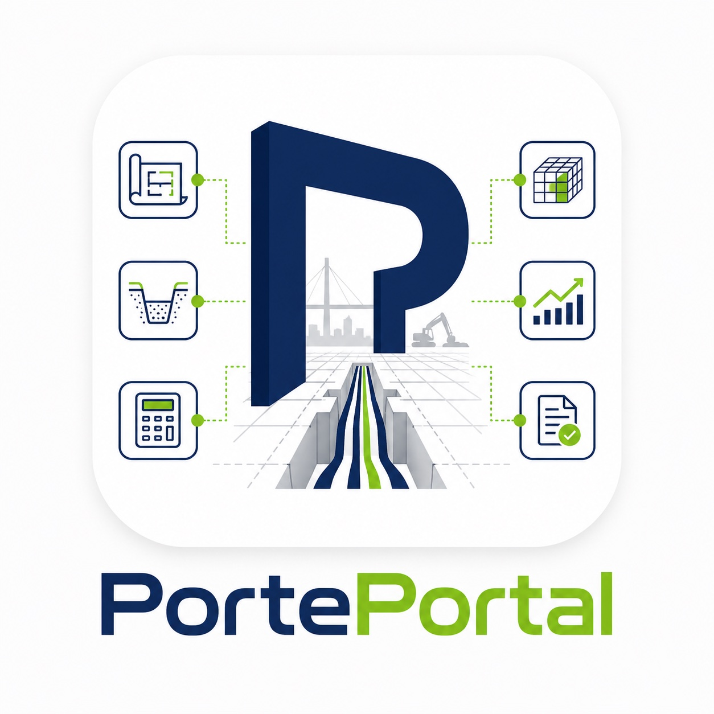

# PortePortal

> **Genius Toolset für Planung und Kalkulation im Tiefbau.**
> Drei spezialisierte Tools, ein durchgängiger Workflow — vom iPad-Vorarbeiter bis zum Büro-PC.



---

## Inhalt

PortePortal bündelt drei Tools:

| Tool | Zweck | Pfad |
|------|-------|------|
| **TiefbauPorte v6** | LIS- & Kabelgraben-Planer (Trasse zeichnen, Profil setzen, Massen automatisch) | `tools/tiefbauporte/` |
| **KalkuPorte** | Schneller Kostenkalkulator (Stunden, Material, Aufschläge → Angebot) | `tools/kalkuporte/` |
| **AushubPorte** | Aushub- und Profil-Schnellrechner (Volumen, Schichten, Verfüllung) | `tools/aushubporte/` |

---

## Repo-Struktur

```
PortePortal/
├── index.html                  # Landing-Page (poliert, voll responsive)
├── manifest.webmanifest        # PWA-Manifest (Portal)
├── sw.js                       # Service Worker (Cache-First, offline-fähig)
├── offline.html                # Offline-Fallback
├── README.md                   # Du bist hier
├── assets/
│   ├── logo-porteportal.png    # Portal-Logo (App-Icon)
│   ├── logo-tiefbauporte.png   # Tool-Logo TiefbauPorte
│   ├── logo-kalkuporte.png     # Tool-Logo KalkuPorte
│   └── logo-aushubporte.png    # Tool-Logo AushubPorte
└── tools/
    ├── tiefbauporte/           # v6 LIS-Planer (komplette v6-Struktur, unverändert)
    │   ├── index.html
    │   ├── app.js, app.css
    │   ├── manifest.json
    │   ├── sw.js
    │   └── modules/
    ├── kalkuporte/
    │   └── index.html          # KalkuPorte v5.23 Schnellkalkulator
    └── aushubporte/
        └── index.html          # AushubPorte
```

---

## Features

- **Voll responsiv**: iPad · PC · Handy. Touch-Targets ≥ 44 px.
- **PWA**: Installierbar via "Zum Home-Bildschirm hinzufügen". Offline-fähig nach erstem Besuch.
- **App-Shortcuts**: Direkte Sprünge zu den drei Tools aus dem App-Drawer.
- **Union E Corporate Design**: Navy `#1B2D5E`, Lime `#78B51A`, Sora/Inter Typografie.
- **Reduced Motion**: respektiert Nutzer-Einstellungen.
- **Static Hosting**: keine Build-Tools nötig, läuft auf jedem Webserver.

---

## Deploy auf GitHub Pages

### 1. Repo anlegen

```bash
# Im PortePortal-Ordner:
git init
git add .
git commit -m "Initial commit: PortePortal v1.0"
git branch -M main

# Repo auf GitHub anlegen, dann:
git remote add origin git@github.com:<username>/PortePortal.git
git push -u origin main
```

### 2. GitHub Pages aktivieren

1. Repo auf GitHub öffnen → **Settings** → **Pages**
2. **Source**: "Deploy from a branch"
3. **Branch**: `main` / `/ (root)` → **Save**
4. Nach 1–2 Minuten ist die Seite unter `https://<username>.github.io/PortePortal/` erreichbar.

### 3. Custom Domain (optional)

1. Datei `CNAME` im Repo-Root anlegen mit deinem Domain-Eintrag (z.B. `portal.union-e.de`).
2. Bei deinem DNS-Anbieter einen `CNAME`-Record auf `<username>.github.io` anlegen.
3. In den Pages-Settings → "Custom domain" eintragen → "Enforce HTTPS" aktivieren.

---

## Deploy auf einem normalen Webserver (Apache/Nginx)

Einfach den kompletten Inhalt des Ordners in das Webroot kopieren:

```bash
# Beispiel: nginx
rsync -avz --delete ./ user@server:/var/www/porteportal/
```

Wichtig:
- Stelle sicher, dass `manifest.webmanifest` mit dem Content-Type `application/manifest+json` ausgeliefert wird.
- HTTPS ist für PWA zwingend (außer auf `localhost`).

---

## Lokale Entwicklung

PortePortal benötigt keinen Build-Schritt. Du kannst es direkt mit einem statischen Server testen:

```bash
# Mit Python:
python3 -m http.server 8080

# Mit Node:
npx serve .

# Browser öffnen:
http://localhost:8080
```

> **Hinweis**: Service Worker funktionieren nur über HTTPS oder `localhost`.

---

## Updates

Beim Update der Dateien einfach die `CACHE_VERSION` in `sw.js` hochzählen:

```js
const CACHE_VERSION = 'porteportal-v1.0.1';  // war: v1.0.0
```

Damit invalidiert der Service Worker den alten Cache automatisch und lädt die neuen Versionen.

---

## Browser-Support

- **Chrome / Edge** (Desktop & Mobile) — voll unterstützt
- **Safari** (iOS & macOS) — voll unterstützt (PWA-Install via Safari-Share-Sheet)
- **Firefox** — voll unterstützt (PWA-Install eingeschränkt)

---

## Lizenz & Hinweis

Internes Werkzeug der **Union E GmbH · Die HPM Mobilmacher**.
Vinckeweg 15 · 47119 Duisburg · [info@union-e.de](mailto:info@union-e.de) · [www.union-e.de](https://www.union-e.de)

---

*Stand: April 2026*
